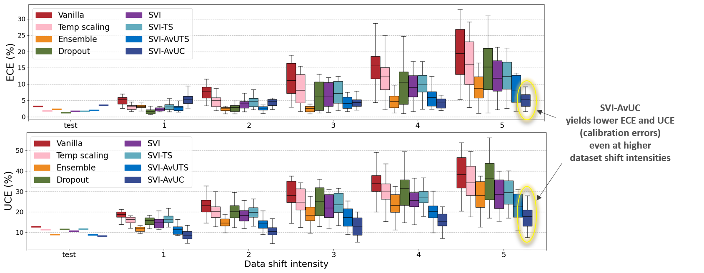
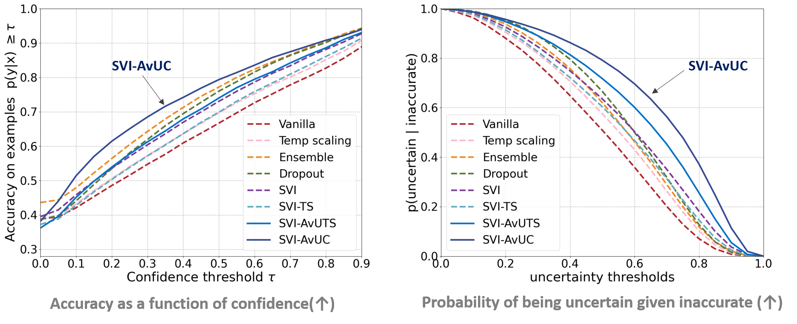
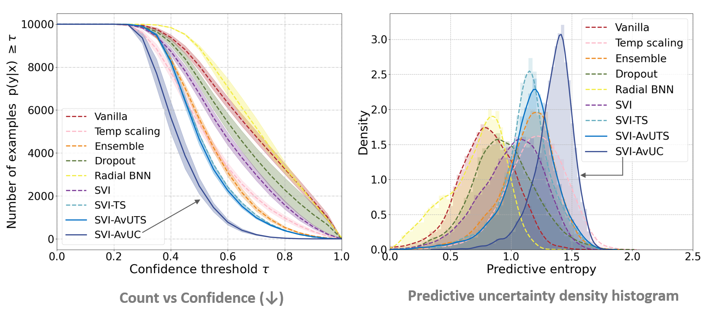
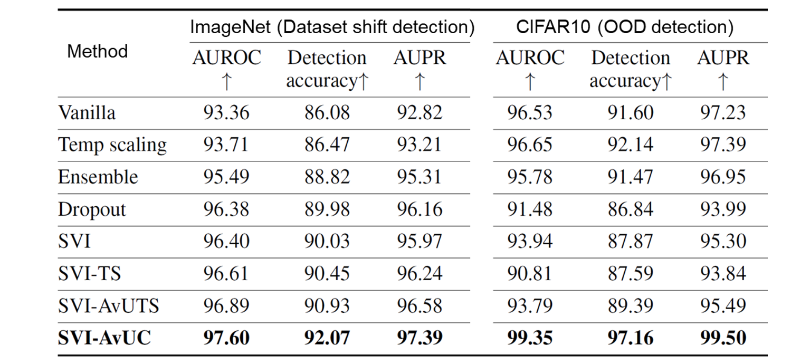

# Accuracy versus Uncertainty Calibration

**[Overview](#overview)**
| **[Requirements](#requirements)**
| **[Example usage](#example-usage)**
| **[Results](#results)**
| **[Paper](https://papers.nips.cc/paper/2020/file/d3d9446802a44259755d38e6d163e820-Paper.pdf)**
| **[Citing](#citing)**


Code to accompany the paper [Improving model calibration with accuracy versus uncertainty optimization](https://papers.nips.cc/paper/2020/hash/d3d9446802a44259755d38e6d163e820-Abstract.html) [NeurIPS 2020].

**Abstract**: Obtaining reliable and accurate quantification of uncertainty estimates from deep neural networks is important in safety critical applications. A well-calibrated model should be accurate when it is certain about its prediction and indicate high uncertainty when it is likely to be inaccurate. Uncertainty calibration is a challenging problem as there is no ground truth available for uncertainty estimates. We propose an optimization method that leverages the relationship between accuracy and uncertainty as an anchor for uncertainty calibration. We introduce a differentiable *accuracy versus uncertainty calibration* (AvUC) loss function as an additional penalty term within loss-calibrated approximate inference framework. AvUC enables a model to learn to provide well-calibrated uncertainties, in addition to improved accuracy. We also demonstrate the same methodology can be extended to post-hoc uncertainty calibration on pretrained models.

## Overview
This repository has code for *accuracy vs uncertainty calibration* (AvUC) loss and variational layers (convolutional and linear) to perform mean-field stochastic variational inference (SVI) in Bayesian neural networks. Implementations of SVI and SVI-AvUC methods with ResNet-20 (CIFAR10) and ResNet-50 (ImageNet) architectures.

We  propose an optimization method that leverages the relationship between accuracy and uncertainty as anchor for uncertainty calibration in deep neural network classifiers (Bayesian and non-Bayesian). 
We propose differentiable approximation to *accuracy vs uncertainty* (AvU) measure [[Mukhoti & Gal 2018](https://arxiv.org/abs/1811.12709)] and introduce trainable AvUC loss function.
A task-specific utility function is employed in Bayesian decision theory [Berger 1985] to accomplish optimal predictions. 
In this work, AvU utility function is optimized during training for obtaining well-calibrated uncertainties along with improved accuracy. 
We use AvUC loss as an additional utility-dependent penalty term to accomplish the task of improving uncertainty calibration relying on the theoretically sound loss-calibrated 
approximate inference framework [[Lacoste-Julien et al. 2011](http://proceedings.mlr.press/v15/lacoste_julien11a.html), [Cobb et al. 2018](https://arxiv.org/abs/1805.03901)] 
rooted in Bayesian decision theory.
## Requirements
This code has been tested on PyTorch v1.6.0 and torchvision v0.7.0 with python 3.7.7.

Datasets:
- CIFAR-10 [[Krizhevsky 2009](https://www.cs.toronto.edu/~kriz/cifar.html)]
- ImageNet [[Deng et al. 2009](http://image-net.org/download)] (download dataset to data/imagenet folder)
- CIFAR10 with corruptions [[Hendrycks & Dietterich 2019](https://github.com/hendrycks/robustness)] for dataset shift evaluation (download [CIFAR-10-C](https://zenodo.org/record/2535967/files/CIFAR-10-C.tar?download=1) dataset to 'data/CIFAR-10-C' folder)
- ImageNet with corruptions [[Hendrycks & Dietterich 2019](https://github.com/hendrycks/robustness)] for dataset shift evaluation (download [ImageNet-C](https://zenodo.org/record/2235448#.X6u3NmhKjOg) dataset to 'data/ImageNet-C' folder)
- SVHN [[Netzer et al. 2011](http://ufldl.stanford.edu/housenumbers/)] for out-of-distribution evaluation (download [file](https://zenodo.org/record/4267245/files/svhn-test.npy) to 'data/SVHN' folder)

Dependencies:

- Create conda environment with python=3.7
- Install PyTorch and torchvision packages within conda environment following instructions from [PyTorch install guide](https://pytorch.org/get-started/locally/)
- conda install -c conda-forge accimage
- pip install tensorboard
- pip install scikit-learn

## Example usage
We provide [example usages](src/) for SVI-AvUC, SVI and Vanilla (deterministic) methods on CIFAR-10 and ImageNet to train/evaluate the [models](models) along with the implementation of [AvUC loss](src/avuc_loss.py) and [Bayesian layers](variational_layers/).

### Training

To train the Bayesian ResNet-20 model on CIFAR10 with SVI-AvUC method, run this script:
```train_svi_avuc
sh scripts/train_bayesian_cifar_avu.sh
```


To train the Bayesian ResNet-50 model on ImageNet with SVI-AvUC method, run this script:
```train_imagenet_svi_avuc
sh scripts/train_bayesian_imagenet_avu.sh
```
### Evaluation

Our trained models can be downloaded from [here](https://zenodo.org/record/4267245#.X6uNBWhKiUm). Download and untar [SVI-AVUC ImageNet model](https://zenodo.org/record/4267245/files/svi-avuc-imagenet-trained-model.tar.gz?download=1) to 'checkpoint/imagenet/bayesian_svi_avu/' folder.


To evaluate SVI-AvUC on CIFAR10, CIFAR10-C and SVHN, run the script below. Results (numpy files) will be saved in logs/cifar/bayesian_svi_avu/preds folder.

```eval_cifar
sh scripts/test_bayesian_cifar_avu.sh
```


To evaluate SVI-AvUC on ImageNet and ImageNet-C, run the script below. Results (numpy files) will be saved in logs/imagenet/bayesian_svi_avu/preds folder.

```eval_imagenet
sh scripts/test_bayesian_imagenet_avu.sh
```

## Results


**Model calibration under dataset shift**

Figure below shows model calibration evaluation with Expected calibration error (ECE↓) and Expected uncertainty calibration error (UCE↓) on ImageNet under dataset shift. At each shift intensity level, the boxplot summarizes the results across 16 different dataset shift types. A well-calibrated model should
provide lower calibration errors even at increased dataset shift.

<p align="center">
  
</p>

**Model performance with respect to confidence and uncertainty estimates**

A reliable model should be accurate when it is certain about its prediction and indicate high uncertainty when it is likely to be inaccurate. We evaluate the quality of confidence and predictive uncertainty estimates using accuracy vs confidence and  p(uncertain | inaccurate) plots respectively.
The plots below indicate SVI-AvUC is more accurate at higher confidence and more uncertain when making inaccurate predictions under distributional shift (ImageNet corrupted with Gaussian blur), compared to other methods.
<p align="center">
  
</p>

**Model reliability towards out-of-distribution data**

Out-of-distribution evaluation with SVHN data on the model trained with CIFAR10. SVI-AvUC has lesser number of examples with higher confidence and provides higher predictive uncertainty estimates on out-of-distribution data.
<p align="center">
  
</p>

**Distributional shift detection performance**

Distributional shift detection using predictive uncertainty estimates. 
For dataset shift detection on ImageNet, test data corrupted with Gaussian blur of intensity level 5 is used. 
SVHN is used as out-of-distribution (OOD) data for OOD detection on model trained with CIFAR10. 

<p align="center">
  
</p>

Please refer to the paper for more results. The results for Vanilla, Temp scaling, Ensemble and  Dropout methods are computed from the model predictions provided in [UQ benchmark](https://console.cloud.google.com/storage/browser/uq-benchmark-2019) [[Ovadia et al. 2019](https://arxiv.org/abs/1906.02530)]

## Citing

If you find this useful in your research, please cite as:
```sh
@article{krishnan2020improving,
  author={Ranganath Krishnan and Omesh Tickoo},
  title={Improving model calibration with accuracy versus uncertainty optimization},
  journal={Advances in Neural Information Processing Systems},
  year={2020}
}
```
